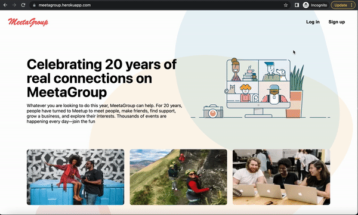
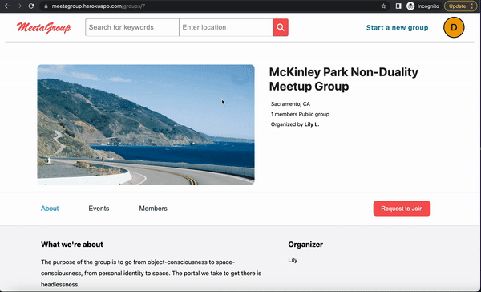
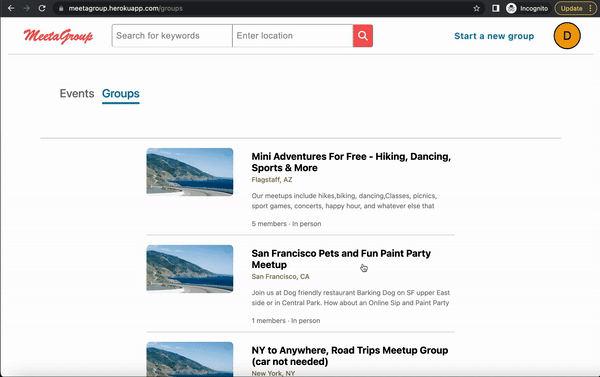

README

Link to live site [MeetaGroup](https://meetagroup.herokuapp.com/)

## Introduction of MeetaGroup

MeetaGroup is a clone of [Meetup](https://www.meetup.com/), it has most of Meetup's functionality. For example, it allows users to create their own groups,
update their groups, as well as deleting the groups. All of the users can explore and search different groups and events. After logging in or signing up,
they can request to join any group they are interested in. After joining the group, they can request to attend or change their RSVP for a specific event
that is related to the group they joined.


## Tech Stack

Frameworks, Platforms, and Libraries:

  

   

Database:


Hosting:


## Usage descriptions of features


### Homepage


### Login modal



### All groups and group details


### All events and event details


### Searching page



### Join and Leave a group



<!-- code block -->


## Run locally

Here is the get started section with instruction on how to set up the repo ro run the project locally


### Clone the repo


### Set up Environment Variables

To run the project locally, you will need to create the .env file in the backend folder with the following environment variables.

```
PORT=8000
DB_FILE=db/dev.db
JWT_SECRET=<<generate_strong_secret_here>>
JWT_EXPIRES_IN=604800
```


### Set up Database

You will need to run the following codes in the backend repository.

```
npx dotenv sequelize db:migrate
npx dotenv sequelize db:seed:all
```

## To do list for future features

- Add Calendar on the event page

- Add Calendar for all evnets in search results

- Add Google Maps for events details

- Improve the searching algorithm

- Refactor the backend routes
# meet-a-group
# meet-a-group
# meet-a-group
# meet-a-group
# meet-a-group
